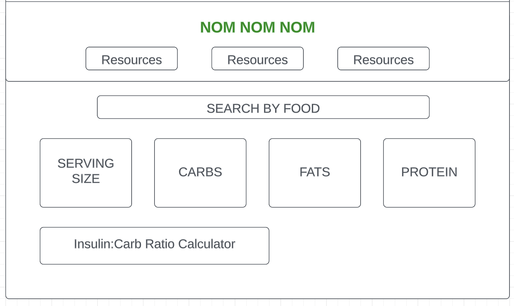

### About The Project

As a type 1 diabtic, eating a healthy diet is necessary to help me:
* Better manage my blood glucose levels
* Determine how much insulin I need
* Prevent or slow the development of diabetes complications

When it comes to food, it is important to check the nutritional label and specifically be informed about how many carbohydrates I am consuming. As the body digests carbohydrates, they are converted into glucose, which becomes the primary fuel source for the body. The level of carbohydrates consumed in a meal has the greatest impact on the blood glucose levels. 

I created Nom Nom Nom, to allow anyone to search a food by its name and recive the nutrional value of it back. With the insulin:carb ratio calculator feature, this app will be especially benefical for diabetics to help them make informed decesions on insulin calculations for meals. 

Nutritonal Values Returened:
* Serving Size 
* Total Fat 
    * Saturated Fat 
    * Trans Fat 
* Total Carbohydrate
    * Dietary Fiber 
    * Total Sugars 
* Protein 

Link to helpful resources also included! 

### Built With
- HTML5
- CSS3
- JavaScript
- jQuery
- Google Fonts 

### Approach Taken 
The initial step for my project was to create the file and folder structure for HTML, CSS, and JS. The following was then done for each file: 

1. HTML 
    - Included a search input field, a search button, a section to display the nutrition information, and a section to input ones insulin-to-carb ratio.
2. JS
    - My main function in JS was to retrieve and display the user's search input when they submit the search form and click the search button.
    - Used the HTTP method, "GET", to send requests to the nutrition API I found. I include the user's search query as a parameter in the request URL to retrieve relevant nutrition data.
    - jQuery was used to make an asynchronous HTTP request and extract the nutritional information requested. 
    - Implemented an error alert to display in cases where the API request failes or returns an error.
    - Created an input box for the insulin:carb ration for users to be able to calculate how many units of insulin they would need (based on the carbohydrates) for the food they just searched. 
  3. CSS
    - Applied styling to my HTML elements to make my webpage more visually appealing and user-friendly.

My final step of the project was deploying my webpage to github pages. 

### Initial Wireframe 

### Unsolved Problems 
XXXX

### Links
XXX
